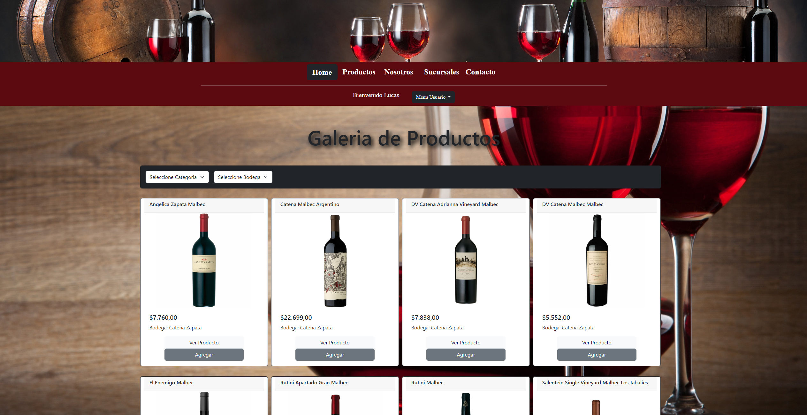
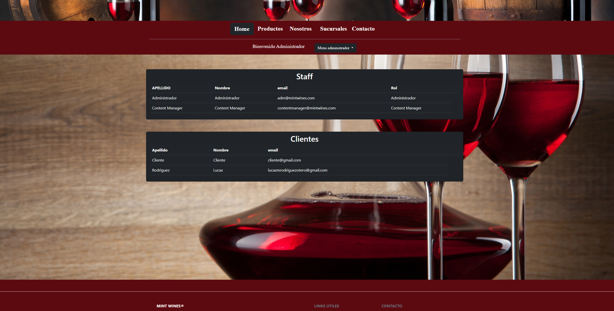
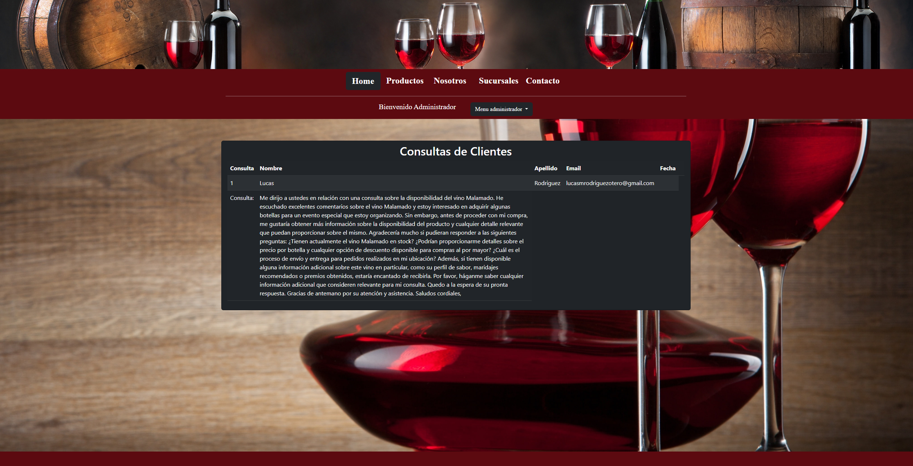
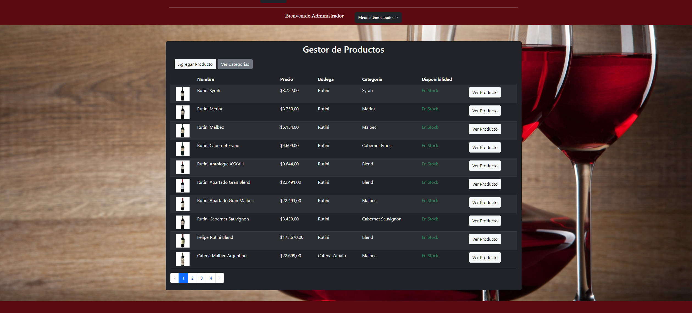
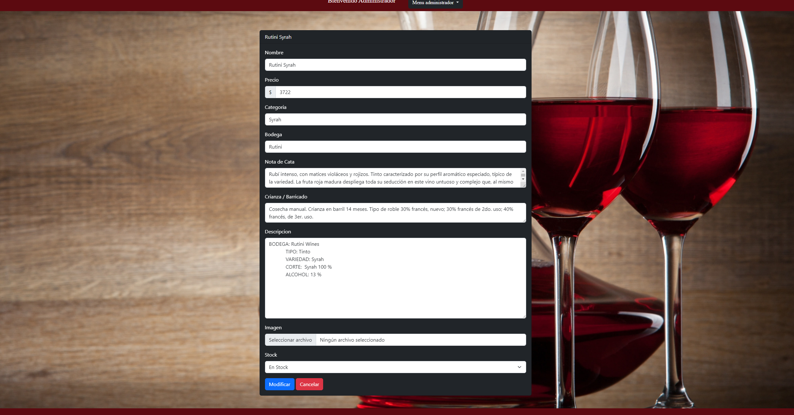
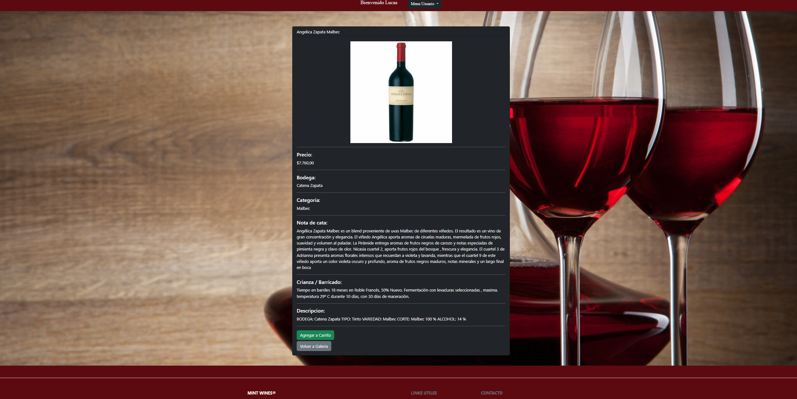
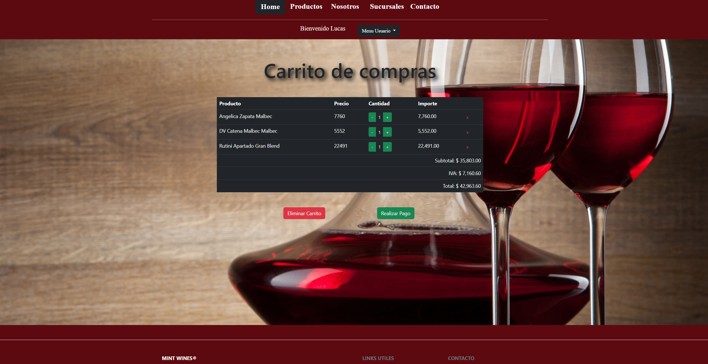

# Project Mint Wines

Este proyecto es un eCommerce desarrollado como parte de un trabajo académico utilizando PHP Laravel como framework y MySQL como base de datos.

## Descripción

La temática de este proyecto es una vinoteca en línea donde los usuarios pueden explorar y comprar una variedad de productos relacionados con el vino. La plataforma cuenta con varias funcionalidades, incluyendo:

- **Catálogo de Productos:** Los usuarios pueden explorar una amplia selección de productos disponibles en la tienda.
- **Filtrado de Búsqueda:** Los usuarios pueden filtrar la búsqueda de productos según diferentes criterios, como tipo de vino, variedad, precio, etc.
- **Página de Presentación:** Información sobre la vinoteca, su historia, y los valores que la caracterizan.
- **Sucursales:** Información sobre las distintas sucursales físicas de la vinoteca.
- **Página de Contacto:** Formulario de contacto para consultas o comentarios.

  

      
     
      

      

    
    

## Tipos de Usuarios

El sistema cuenta con tres tipos de usuarios, cada uno con diferentes niveles de acceso y funcionalidades:

1. **Administrador:** Tiene acceso completo al sistema y puede gestionar todos los aspectos del contenido, incluyendo la gestión de usuarios, productos, sucursales, y demás.

   

    
    

2. **Content Manager:** Este tipo de usuario tiene acceso limitado y puede gestionar el contenido de la plataforma, como agregar, editar o eliminar productos, pero no tiene acceso a la gestión de usuarios ni otras funciones administrativas.

   

    
    
    

3. **Cliente:** Los clientes pueden navegar por el catálogo de productos, agregar productos al carrito, realizar compras y gestionar su propio perfil de usuario. No tienen acceso a funciones administrativas.

   

    
    
    

## Requisitos del Sistema

- PHP >= 7.3
- Composer
- MySQL

## Instalación

1. Clona el repositorio: `git clone https://github.com/LucasRodriguezOtero/Project-Mint-Wines-.git`
2. Instala las dependencias: `composer install`
3. Copia el archivo `.env.example` y renómbralo a `.env`
4. Configura tu base de datos en el archivo `.env`
5. Genera una nueva clave de aplicación: `php artisan key:generate`
6. Ejecuta las migraciones de la base de datos: `php artisan migrate`
7. Ejecutar las seed `php artisan db:seed`  
8. Inicia el servidor: `php artisan serve`

 ## Gracias!
